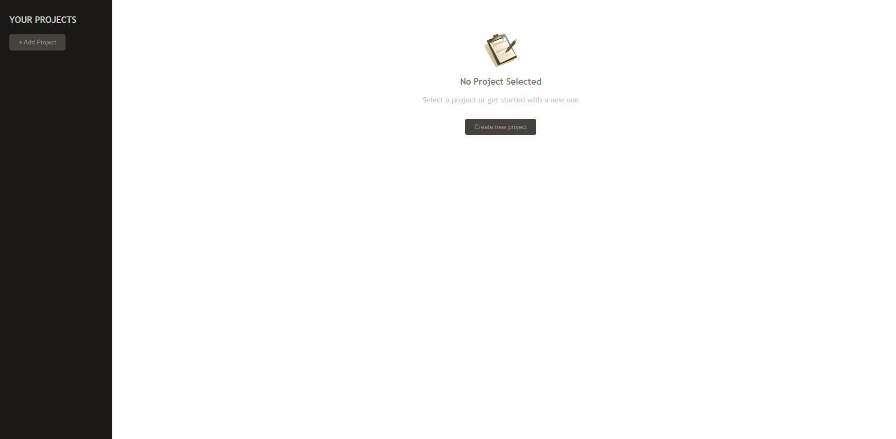
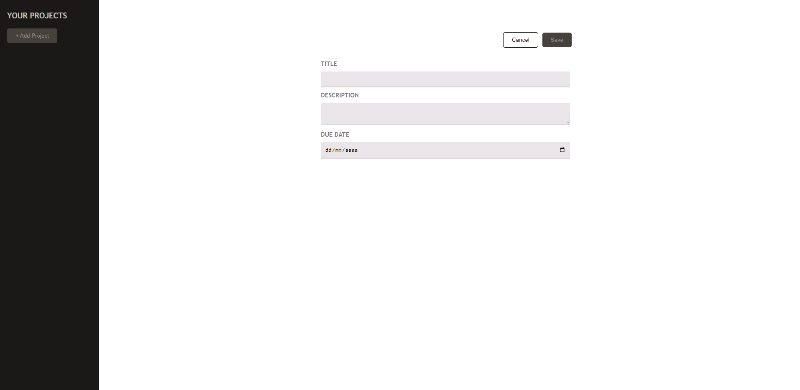
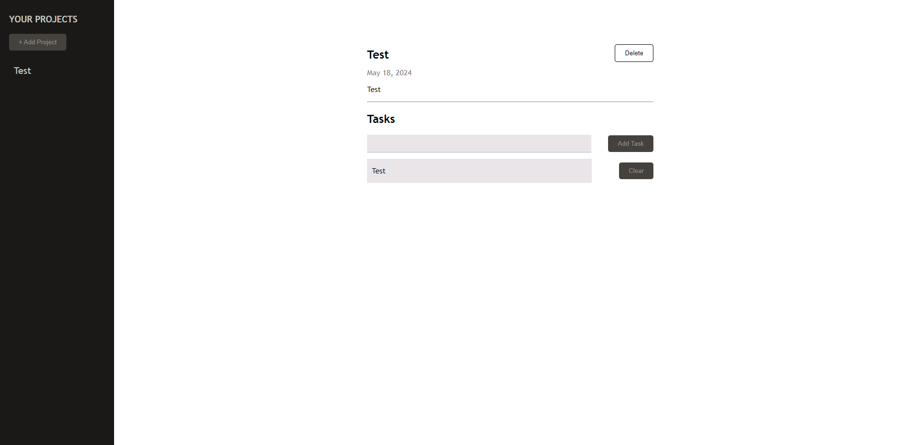

<div align="center">

# Project Tasks

Empower yourself in project management with Project Tasks - a user-friendly app for organizing your projects and tasks seamlessly. Craft projects effortlessly and assign tasks individually, ensuring clarity and progress tracking. Simplify your workflow and stay on top of your goals with ProjectTasker.

</div>

---

## 🚀 Live Demo

**Live Preview** ➡️ [Demo](#)

---

## 🛠️ Installation Steps

Follow the steps below to set up the project:

1. **Clone the repository**

```
git clone https://github.com/AMaroto98/ProjectTasks.git
```

2. **Install dependencies**

```
cd ProjecTasks
npm install
```

3. **Start the server**

```
npm run dev
```

Once the server is up and running, you can access the Project Tasks application in your web browser.

---

## 💻 Tech Stack


---

## 🖼️ Project Screenshots

Explore the Project Tasks with these captivating screenshots, highlighting its sleek and user-friendly interface.







---

<div align="center">
Made with ❤️ by AMaroto98.
</div>
